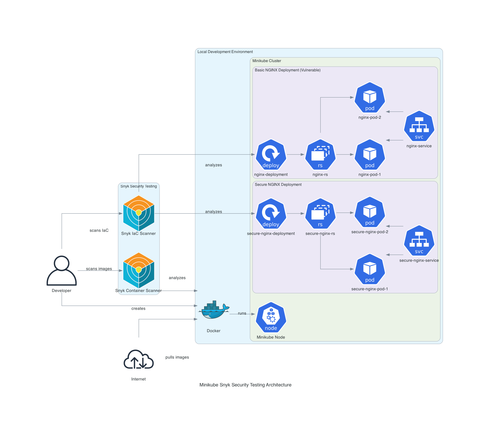

# Minikube Snyk Security Demo

This repository demonstrates how to deploy applications to Minikube and scan them for vulnerabilities using Snyk.



## Prerequisites

- Minikube
- kubectl
- Snyk CLI
- Docker

## Steps

1. **Start Minikube**
   ```bash
   minikube start
   ```

2. **Install Snyk CLI**
   ```bash
   brew install snyk-cli
   ```

3. **Authenticate with Snyk**
   ```bash
   snyk auth
   ```

4. **Deploy Basic NGINX Application**
   ```bash
   kubectl apply -f nginx-deployment.yaml
   ```

5. **Scan for Vulnerabilities**
   ```bash
   snyk iac test nginx-deployment.yaml
   snyk container test nginx:1.14.2
   ```

6. **Deploy Secure NGINX Application**
   ```bash
   kubectl apply -f secure-nginx-deployment.yaml
   ```

7. **Scan Secure Deployment**
   ```bash
   snyk iac test secure-nginx-deployment.yaml
   snyk container test nginx:1.28.0-alpine
   ```

## Security Improvements


The secure NGINX deployment includes:
- Using a more secure base image (nginx:1.28.0-alpine)
- Setting resource limits for CPU and memory
- Adding liveness probes for better health monitoring
- Setting imagePullPolicy to Always to ensure the latest image is used

## Vulnerability Comparison


| Deployment | Container Vulnerabilities | IaC Issues |
|------------|--------------------------|------------|
| Basic NGINX | 252 (28 critical, 47 high, 52 medium, 125 low) | 9 (0 critical, 0 high, 3 medium, 6 low) |
| Secure NGINX | 2 (0 critical, 2 high, 0 medium, 0 low) | 5 (0 critical, 0 high, 3 medium, 2 low) |
| Fully Secure NGINX | 2 (0 critical, 2 high, 0 medium, 0 low) | 0 (0 critical, 0 high, 0 medium, 0 low) |

## Repository Structure

- `nginx-deployment.yaml`: Basic NGINX deployment
- `secure-nginx-deployment.yaml`: Improved NGINX deployment
- `fully-secure-nginx-deployment.yaml`: Fully secure NGINX deployment
- `snyk-reports/`: Detailed Snyk scan reports
- `generated-diagrams/`: Architecture and security diagrams
- `step-by-step-guide.md`: Detailed step-by-step instructions

## Access the Application

```bash
minikube service secure-nginx-service --url
```
